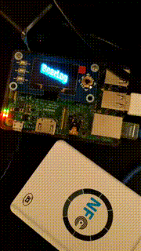

# BeerLog

Program NFC215 tags with some code, and use that to keep a leaderboard of who is drinking the manyest beers.

<p align="center"></p>

Tested with [these NFC215 stickers](https://www.aliexpress.com/item/32817199724.html). Program them with your phone and your [favorite app](https://github.com/HiddenRamblings/TagMo).

NFC reader is [this one](https://www.aliexpress.com/item/32548770388.html).

## Installation

```
sudo apt install python-virtualenv
virtualenv -p python3 --system-site-packages beerlog
cd beerlog
source bin/activate

git clone https://github.com/conchyliculture/beerlog
pip install -r requirements.txt

sudo apt install jq
wget  https://goto.ninja/beertags -O - | jq ".[keys[1]]" | jq "del(.|.[].release)" > known_tags.json
```

In `known_tags.json`, add the optional characteristics `realname` or `glass` to each entry:
```
{
  "0x0000000000000002": {
     "name": "Marius",
     "realname": "Raymond",
     "glass": "40" // This is in cL
}
```

This way, `Raymond` will be displayed in the UI instead of `Marius`, and we'll count 0.8 beers (1 beer == 50cL).


```


PYTHONPATH="." python beerlog/cli/beerlog_cli.py
```

## Tests

I have some!

```
python run_tests.py
```
